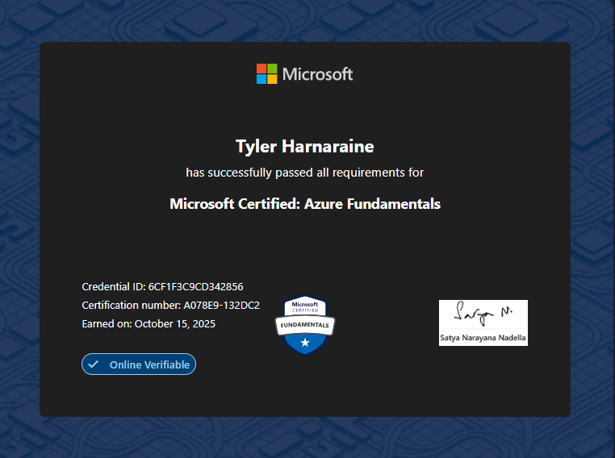

# Building the Cloud Resume Challenge on Azure: What I Actually Learned

**Live Site:** [tylerharn.live](https://tylerharn.live/)

Over the past year, I had been eyeing the Cloud Resume Challenge, but never had the time to fully commit to working through each concept.

Below I will walk through each step of the challenge and highlight my key learnings, challenges, and areas of growth.

***

## Step 1: Certification

The first step in the Azure Cloud Resume Challenge is to obtain the AZ-900.

I came into this project with existing Azure experience from my past 3 internships, but had never taken the AZ-900 exam to build a formal foundation in the platform. I personally felt I was lacking in certain areas, such as pricing models, compliance, and the various services offered. Through studying for 3 weeks, I further deepened my knowledge in these areas and ended up passing the exam on the first attempt.

**Key takeaway:** Even with hands-on experience, a structured certification forces you to confront the parts of the platform you've been working around rather than truly understanding.

## Step 2 & 3:  HTML & CSS 

The next step in the project was converting my existing PDF resume into a website using HTML and CSS. 

Haven taken a web design course during my studies, I was already familiar with the fundamentals of both technologies, which made this stage straightforward. While the implementation itself wasn't particularly challenging, it provided a solid opportunity to reinforce core front-end development concepts. 

## Step 4 & 5: Static Website & CDN HTTPS 

To deploy my website, the official Cloud Resume Challenge recommends using the Azure Storage Static Website feature. However, due to limitations with my Azure for Students subscription, I was unable to create an Azure CDN endpoint for my storage account. Since a CDN endpoint was a required component for enabling HTTPS and improving content delivery, I needed to find an alternative approach

To work around this limitation, I created an Azure Static Web App resource instead. Azure Static Web Apps provided built-in CDN capabilities and automatic HTTPS support, allowing me to continue the challenge without requiring a separate CDN configuration.

Using Azure Static Web Apps, I deployed my website's frontend files: HTML, CSS, and Error File. 

## Step 5 & 6: DNS Registration

The next step involved registering a custom domain and configuring DNS records to point traffic to my Azure-hosted resume website.

For the domain registration, I used Name.com, which was available at no additional cost through the GitHub Student Developer Pack. This provided a free domain that I could use to give my resume website a more professional URL rather than relying on the default Azure Static Web Apps address which wasn't the most friendly looking. 

After registering `tylerharn.live`, I connected the domain to my Azure Static Web App by adding the custom domain through the Azure portal. Azure  provided the required DNS configuration details, including the CNAME record needed to route traffic from my domain to the Static Web App endpoint.

Once the DNS records propagated, I verified the custom domain connection and enabled HTTPS through Azure Static Web Apps. This allowed my website to be securely accessed through `https://tylerharn.live` with an automatically managed SSL certificate.

